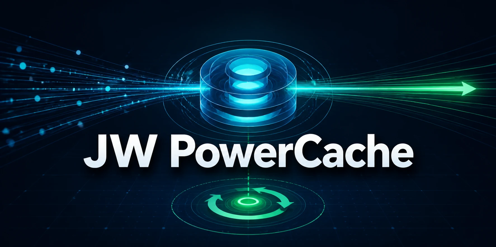

<p align="center">
  
</p>

# JW PowerCache

**Gnuboard 7 공개 API를 더 빠르게 제공하는 비회원 응답 캐시 플러그인입니다.** 페이지, 쇼핑몰 카테고리, 공개 게시판 목록의 반복 조회를 캐시하고 콘텐츠 변경 시 세대를 회전해 이전 응답을 즉시 무효화합니다.

현재 버전은 `0.3.0-beta.2 Open Source Beta`입니다. 제품명은 **JW PowerCache**, G7 플러그인 식별자는 `jw-power_cache`입니다. 공식 Gnuboard 7 `7.0.9` 이상과 해당 버전에 포함된 Page `1.1.0`, Board `1.1.0`, Ecommerce `1.2.0` 이상을 지원합니다.

## 플러그인 용도

- 로그인하지 않은 방문자가 반복 조회하는 공개 JSON API의 응답속도 개선
- 페이지·상품·게시글 변경 시 TTL 대기 없이 관련 캐시 즉시 무효화
- 인증·쿠키·민감 헤더가 있는 요청은 캐시하지 않고 원본으로 우회
- 캐시 장애 시 사이트 오류를 만들지 않고 원본 응답으로 fail-open
- 별도 저장소를 만들지 않고 **G7 관리자가 선택한 표준 캐시 저장소** 사용

## 빠른 설치

1. G7 관리자에서 **플러그인 설치**를 열고 아래 저장소 URL을 입력합니다.

   ```text
   https://github.com/jiwonpapa/jw-power-cache
   ```

2. `JW PowerCache`를 설치·활성화합니다. 최초 실행 모드는 안전한 `observe`입니다.
3. 서버에서 진단 후 캐시를 켭니다.

   ```bash
   php artisan power-cache:doctor
   php artisan power-cache:mode active
   ```

별도 `JW_POWER_CACHE_REDIS_*` 환경변수는 필요하지 않습니다. 여러 웹 노드를 운영한다면 G7 관리자에서 Redis 같은 공유 캐시 저장소를 선택하십시오.

## 현재 지원 범위

| 구분 | 지원 |
|---|---|
| 공개 페이지 상세 | `api.modules.sirsoft-page.pages.show` |
| 쇼핑몰 공개 카테고리 | `categories.index`, `categories.show` |
| 공개 게시판 목록 | 비회원 read 권한 게시판의 1~3페이지, `per_page` 최대 50 |
| 인증 요청 | 항상 BYPASS |
| 쿠키·미등록 query·미등록 route middleware | 항상 BYPASS |
| 게시글 상세·상품·검색·장바구니·주문 | 현재 캐시하지 않음 |
| 응답 형식 | 200 JSON, 크기 상한 이내 |
| 저장 금지 | Set-Cookie, no-store, redirect, 인증/다운로드 헤더, 미지원 Vary |

카테고리 트리에 공개 상품 수가 포함되므로 카테고리뿐 아니라 상품 생성·수정·삭제·일괄 변경도 `category:tree` 세대를 회전합니다.

게시판 목록은 원본 `permission:user,sirsoft-board.{slug}.posts.read`와 같은 `GuestRoleResolver`로 비회원 권한을 먼저 확인합니다. 글·댓글·첨부·게시판 설정·권한·작성자 표시가 바뀌면 `board:all` 세대를 즉시 회전합니다. `created_at_formatted`, `is_new`, 조회수처럼 DB 쓰기 없이도 표시가 변하는 값만 60초 시계 버킷으로 제한하며, 콘텐츠 신선도는 계속 변경 훅 무효화가 담당합니다. PC/모바일 `per_page` 차이는 별도 키로 격리합니다.

## 정합성 모델

1. 공식 G7 동기식 변경 훅에서 outbox와 `dirty_event_id`를 기록합니다. 훅이 원본 트랜잭션 안에서 실행되는 경로는 함께 커밋·롤백되고, 커밋 뒤 실행되는 경로는 내구성 있는 후속 outbox로 처리됩니다.
2. outbox ID를 세대 값으로 적용하고, 미적용 outbox가 하나라도 있으면 복구 전까지 모든 HIT를 금지합니다.
3. 정상 HIT는 G7 관리자가 선택한 표준 캐시 저장소의 clean runtime snapshot, 비상 장벽, 현재 세대 벡터를 모두 통과해야 합니다. DB state는 snapshot 최초 생성·dirty 복구·운영 진단 때만 읽습니다.
4. 캐시 저장소 오류가 나면 원본 컨트롤러로 fail-open하고 캐시 때문에 5xx를 만들지 않습니다.

변경 감지 시 표준 캐시 저장소의 비상 장벽을 세우고, 세대 적용·outbox 완료·clean snapshot 반영이 모두 끝난 뒤 장벽을 내립니다. 평상시 HIT는 파워캐시 자체 DB 질의를 만들지 않습니다. 트랜잭션 내부 훅의 정상 rollback은 해당 이벤트 토큰만 해제하며, 더 최신 이벤트의 장벽은 해제할 수 없습니다.

Redis eviction이나 운영 실수로 barrier, snapshot, generation 키 하나만 사라져도 값 `0`으로 간주하지 않습니다. 모든 HIT를 막고 DB의 runtime epoch를 회전한 뒤 알려진 전체 generation 제어면을 재구축하므로, 물리적으로 남은 과거 응답은 새 키 공간에서 도달할 수 없습니다.

공식 G7 7.0.9에는 플러그인 훅을 서비스 트랜잭션 안으로 강제하는 별도 capability가 없습니다. 따라서 doctor는 이를 오류가 아닌 보증 수준 경고로 표시합니다. 표준 동기 훅만으로 active 사용이 가능하지만, 프로세스가 원본 커밋 직후 훅 호출 전에 비정상 종료되는 매우 짧은 구간은 원자적으로 차단하지 못합니다. 직접 SQL·importer처럼 공식 훅을 우회하는 변경과 함께 이 제한 때문에 현재 버전은 Open Source Beta입니다.

사이트 전역 설정과 모듈·플러그인·템플릿·언어팩 생명주기는 아직 일반 after 훅 경계입니다. 이 관리 작업은 `bypass` 전환 → 작업 수행 → `purge --scope=site` → doctor → `active` 순서의 유지보수 절차를 적용해야 합니다.

`retention_seconds`는 오래된 물리 엔트리를 회수하기 위한 백엔드 보존시간입니다. 데이터 신선도 TTL이 아닙니다. 세대가 바뀐 엔트리는 보존시간이 남아도 즉시 MISS입니다.

## 터미널 설치

개발·서버 환경에서 번들 소스로 설치하려면 저장소를 G7의 `_bundled` 디렉터리에 복제합니다.

PowerCache는 별도 저장소·Redis 연결·환경변수를 만들지 않습니다. G7 관리자가 시스템 캐시 설정에서 선택한 표준 저장소를 그대로 사용합니다.

```bash
git clone https://github.com/jiwonpapa/jw-power-cache.git plugins/_bundled/jw-power_cache
php artisan extension:update-autoload
php artisan plugin:install jw-power_cache --vendor-mode=bundled
php artisan plugin:activate jw-power_cache
php artisan power-cache:doctor
```

설치 기본 모드는 `observe`입니다. 이 모드는 적합성만 검사하고 응답을 저장하거나 HIT로 제공하지 않습니다. doctor를 통과한 뒤 `php artisan power-cache:mode active` 또는 관리자 플러그인 설정에서 `active`로 바꿉니다.

### G7 표준 캐시 저장소

관리자가 G7에서 허용된 `file`, `redis`, `memcached` 캐시 드라이버를 바꾸면 PowerCache도 같은 저장소로 전환됩니다. 플러그인 내부에는 저장소 선택 UI나 `JW_POWER_CACHE_REDIS_*` 우회 설정이 없습니다.

- 단일 웹 노드: G7 관리자가 선택한 file/redis/memcached 저장소 사용 가능
- 여러 웹 노드: G7 관리자에서 모든 노드가 공유하는 Redis 같은 저장소 선택 필요
- 저장소 변경 후: `power-cache:purge --scope=site`와 `power-cache:doctor` 실행

플러그인은 `FLUSHDB`나 전체 key scan으로 무효화하지 않습니다. 세대만 회전하고 물리 엔트리 만료와 정리는 G7 표준 저장소가 담당합니다.

## 운영 명령

```bash
php artisan power-cache:doctor
php artisan power-cache:status
php artisan power-cache:mode bypass
php artisan power-cache:mode observe
php artisan power-cache:mode active
php artisan power-cache:purge --scope=site --reason=deploy
php artisan power-cache:purge --scope=page --reason=page-import
php artisan power-cache:purge --scope=category --reason=product-import
php artisan power-cache:purge --scope=board --reason=board-import
php artisan power-cache:reconcile --limit=100
php artisan power-cache:gc --days=7
php artisan power-cache:restore-finalize --yes
```

- `doctor`: G7 관리자가 선택한 표준 저장소 read/write, DB state/outbox, route·middleware 계약을 검사합니다.
- `status`: 현재 모드와 dirty/outbox 상태를 조회합니다.
- `mode`: `bypass`(OFF), `observe`(저장 없이 판정), `active`(ON)를 전환합니다. `active`는 doctor가 실패하면 전환 자체를 차단합니다.
- `purge`: key 삭제 없이 `site`, `page:all`, `category:tree`, `board:all` 세대를 회전합니다.
- `reconcile`: 중복·역순 실행에도 안전하게 미적용 outbox를 재생합니다.
- `gc`: 적용 완료된 오래된 outbox 감사 이력을 정리합니다. 캐시 물리 엔트리 수명은 G7 표준 저장소가 담당합니다.
- `restore-finalize`: 유지보수 모드와 `bypass`에서만 실행되며, 복구된 outbox를 정리한 뒤 runtime epoch를 회전하고 전체 제어면을 재구축합니다. `--yes`가 없거나 사이트가 온라인이면 변경하지 않습니다.

더미 생성기, importer, seed, 외부 SQL처럼 공식 Service 훅을 우회하는 변경 뒤에는 반드시 해당 scope purge를 실행해야 합니다. 변경 범위를 모르면 `--scope=site`를 사용하십시오.

활성 플러그인은 `reconcile --limit=100`을 매분 예약해 저장소 장애 뒤 남은 outbox를 자동 재생하며, 일일 GC는 적용 완료된 감사 이력만 정리합니다. 서버의 Laravel scheduler가 실제로 실행 중이어야 합니다.

## 백업 복구 순서

백업에는 G7 전체 데이터베이스, `storage/app/plugins/jw-power_cache/settings/setting.json`, 설치한 플러그인 ZIP과 체크섬을 함께 보관하십시오. Redis는 원본 데이터가 아니므로 백업본을 복원하지 않습니다.

```bash
php artisan power-cache:mode bypass
php artisan down --retry=60
# queue worker를 멈춘 뒤 DB, 설정 파일, 플러그인 코드를 복구
php artisan power-cache:restore-finalize --yes
php artisan power-cache:doctor
php artisan up
```

`restore-finalize`가 실패하면 유지보수 모드를 해제하지 마십시오. 비상 dirty 장벽, 미적용 outbox, Redis 연결을 먼저 확인해야 합니다. 격리 환경 연습 도구는 정확한 DB 이름과 명시적 파괴 허용값을 모두 요구합니다.

```bash
G7_ROOT=/path/to/isolated-g7 \
JWPC_RESTORE_DRILL_ALLOW_DESTRUCTIVE=1 \
JWPC_RESTORE_DRILL_EXPECT_DATABASE=isolated_database \
php tool/run-backup-restore-drill.php
```

## 보안 불변식

다음 항목은 관리자 설정으로 완화할 수 없습니다.

- GET/HEAD 및 정확한 route allowlist만 허용
- Authorization/Proxy-Authorization와 민감 토큰 헤더가 있으면 BYPASS
- 사용자 객체나 쿠키가 하나라도 있으면 BYPASS
- route 정책에 없는 query/middleware가 있으면 BYPASS
- 게시판 목록은 원본과 같은 guest read 권한 선검증 실패 시 BYPASS
- 게시판 목록은 1~3페이지·`per_page` 최대 50만 허용하고 PC/모바일 키를 분리
- 같은 route에 다른 before_core/after_core 확장 미들웨어가 겹치면 BYPASS
- 공개 응답을 변형하는 origin filter hook이 등록되어 있으면 BYPASS
- 저장 전후 세대가 다르면 미저장
- HEAD MISS는 원본만 호출하고 캐시를 생성하지 않음
- Set-Cookie/no-store/인증·다운로드·redirect 응답은 미저장
- 세대 확인이나 복구 장벽 확인이 실패하면 stale 응답 제공 금지

기본 Laravel JSON 응답의 `private, no-cache`는 브라우저 캐시 정책으로 보존하되, 서버 내부 origin cache 저장 자체를 막지는 않습니다. `no-store`만 절대 저장 금지입니다.

## 알려진 제한

- 현재 실제 HIT 지원은 페이지 상세, 카테고리 API, 공개 비회원 게시판 hot-list입니다.
- 캐시 HIT는 extension `api, after_core` 지점에서 반환됩니다. Laravel 미들웨어 우선순위상 `optional.sanctum`과 throttle은 HIT 전에도 실행되며, 게시판 route permission은 뒤쪽에 있어 플러그인이 같은 `GuestRoleResolver`로 먼저 검사합니다. 이 순서를 doctor의 정확한 middleware 계약으로 고정합니다.
- `after_core` 앞에서 실행되는 코어 API 미들웨어와 rate-limit 비용은 남습니다. runtime barrier와 페이지·카테고리 HIT는 플러그인 DB를 읽지 않지만, 게시판은 guest role/permission을 요청당 한 번 읽습니다. 전체 HTTP 요청을 0-query로 만들려면 인증·권한·IDV·rate-limit 뒤/컨트롤러 앞의 공식 코어 seam 또는 PHP 부팅 전 서버 어댑터가 필요합니다.
- 직접 SQL 변경을 자동 감지할 수 없습니다.
- 공식 G7 7.0.9의 커밋 후 훅에는 앞서 설명한 짧은 비원자 구간이 남습니다.
- 사이트 전역 설정·확장 생명주기는 아직 동일 트랜잭션 seam 대상이 아니므로 유지보수 중 bypass와 완료 후 site purge가 필요합니다.
- 다중 노드에서 G7 관리자가 file 저장소를 선택한 구성은 지원하지 않습니다.
- 전체 페이지 HTML, 바이너리, 검색 결과, 사용자별 응답은 지원하지 않습니다.
- PHP/Laravel 부팅 전 캐시는 별도 서버 어댑터 범위입니다.

## 검증

Gnuboard 7 루트를 지정해 독립 테스트를 실행합니다.

```bash
G7_ROOT=/path/to/gnuboard7 \
  /path/to/gnuboard7/vendor/bin/phpunit --no-configuration \
  --bootstrap tests/bootstrap.php tests
```

현재 공식 G7 7.0.9·MySQL 8.4·Redis 7.4 독립 테스트는 **52 tests / 438 assertions / 2 optional-seam skips**입니다. guest 격리, 공식 G7 표준 캐시 계약, 게시판 read 권한·페이지 범위·PC/모바일 변형, 변경 훅 커버리지, 응답 저장 금지, 변조·구형 저장물 거부, 설정·스케줄 계약, 세대 단조성, 제어 키 선택 유실, 충돌 토큰, DB lease lock, 정상 HIT의 플러그인 DB query 0, MISS→HIT, 원본 변경과 outbox commit/rollback, 저장소 장애와 outbox 자동 재생, 복구 후 epoch 회전·제어면 재구축, 벤치마크 판정을 검증합니다. CI는 PHP 8.2/8.5, 공식 G7 7.0.9 커밋, Redis 7.4, MySQL 8.4, MariaDB 11.4를 검사합니다.

실서버 공개 HTTPS에서 수행한 최신 5VU 비교 결과는 [g7devops.com 실서버 벤치마크](docs/benchmark/g7devops-live-5vu-2026-09-01.md)에 기록되어 있습니다. 4개 주요 API, 총 2,880건에서 오류·응답 불일치 없이 경로별 p95가 49.0~68.9% 개선됐습니다.

이전 실서버 ON/OFF 결과는 [온라인 ON/OFF 실측 보고서](docs/benchmark/jw-power-cache-live-ab-report-2026-08-23.md)에 기록되어 있습니다.

Redis 로컬 재현 환경의 3회 중앙값 게시판 성능 결과는 [로컬 Beta 성능 보고서](docs/benchmark/local-beta-performance-2026-09-01.md)에 기록되어 있습니다. 15분 FPM 내구성·장애 주입 결과는 [장애 캠페인 보고서](docs/benchmark/local-fpm-fault-campaign-2026-09-01.md)에 기록되어 있습니다.

과거 transaction-seam 후보에서 수행한 클린 설치·활성화·비활성화·데이터 제거·재설치 결과는 [클린 수명주기 검증 보고서](docs/verification/clean-lifecycle-2026-09-01.md)에 기록되어 있습니다. 공식 7.0.9 및 표준 저장소 기준 결과는 Beta.2 릴리스 보고서에 별도로 기록합니다.

관리자 설정 실브라우저 결과는 [관리자 설정 검증 보고서](docs/verification/admin-settings-browser-2026-09-01.md), 실제 백업 복구와 릴리스 롤백 결과는 [복구·롤백 검증 보고서](docs/verification/backup-restore-release-rollback-2026-09-01.md)에 기록되어 있습니다.

제품화 기준과 운영 문서는 [로드맵](ROADMAP.md), [아키텍처·장애 모델](docs/architecture.md), [성능 검증 방법](docs/benchmark/methodology.md), [릴리스 체크리스트](docs/release-checklist.md), [보안 정책](SECURITY.md), [지원 범위](SUPPORT.md)에서 확인할 수 있습니다.
