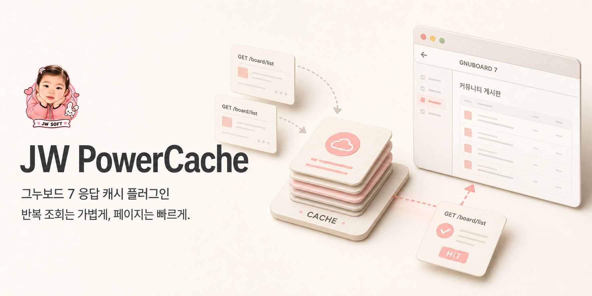
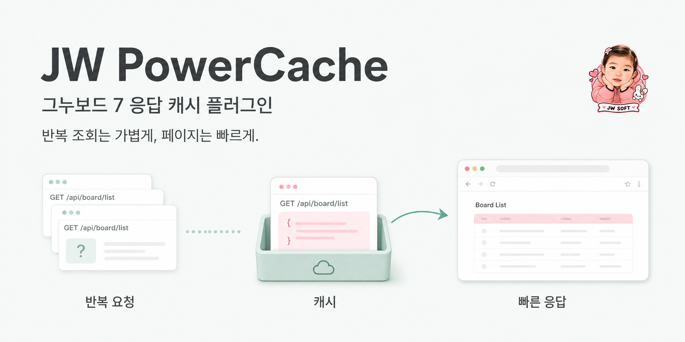
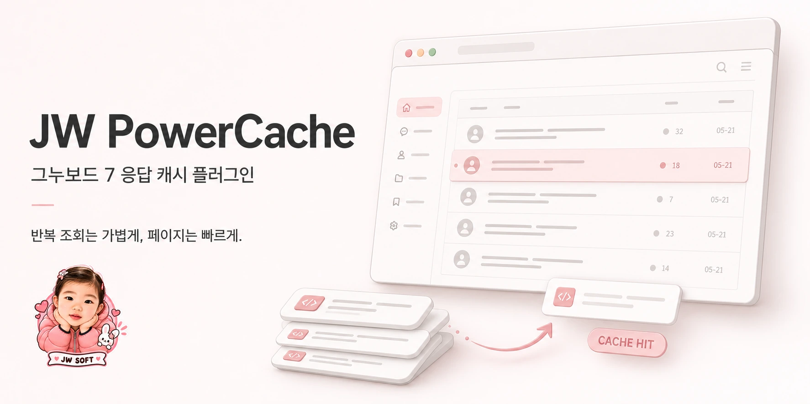

# JW PowerCache — intro image collection

Created 2026-09-02 with the built-in image generation tool using the user-provided JW SOFT logo.
Variant 3 (Blush browser) was selected as the main repository README banner.
The README uses its optimized WebP copy; all three original PNG files are retained here.

## Designs

1. [Ivory editorial](01-ivory-editorial.png) — warm ivory, soft paper layers.
2. [Mint cache flow](02-mint-cache-flow.png) — clear request → cache → response explanation.
3. [Blush browser](03-blush-browser.png) — browser-first product illustration, **selected main banner**.







All three originals are 1774 × 887 PNG banners (2:1). The source logo is unchanged.
UI panels and request labels are conceptual illustrations, not API documentation.
No performance measurements or speed multipliers are claimed.

## Final prompt set

### Variant 1

```text
Use case: ads-marketing.
Asset type: one finished wide GitHub README introduction banner for the existing Gnuboard 7 plugin JW PowerCache, landscape approximately 2:1, high-resolution 2000x1000 composition. Make one banner only, not a contact sheet.
Primary request: Soft, modern, contemporary, very simple and elegant. It must instantly communicate a caching plugin: repeated web-data requests reuse a stored response and are returned quickly, reducing repeated server work. This is API response caching, not a payment app, not a money app, not a full browser replacement.
Input image 1: supporting brand-logo insert. It is the user's actual JW SOFT sticker logo: the same little girl in pink with hands under her face, pink hearts, white rabbit, and JW SOFT ribbon. Preserve this identity and its exact face, pose, colors, proportions and lettering. Do not redraw as a different child or mascot. Remove the baked-in gray checkerboard background cleanly around the entire sticker. Use the complete logo just once, very small, around 7 percent of banner width and never above 9 percent, a secondary signature not the main subject. Preserve readable ribbon. No checkerboard anywhere.
Typography: premium calm editorial sans serif, dark charcoal rather than black. Render product name exactly "JW PowerCache". Korean exact copy "그누보드 7 응답 캐시 플러그인" and "반복 조회는 가볍게, 페이지는 빠르게." These are the only headline/supporting copy. No invented benchmarks, timings, percentages, version numbers or promises.
Avoid: cyberpunk, neon, lasers, glowing circuit boards, holograms, space backgrounds, black tech dashboards, harsh gradients, giant logo, children elsewhere in the scene, rockets, enormous lightning bolts, heavy gloss, clutter, fake UI paragraphs, charts, sales buttons, watermarks. Ample whitespace and clear hierarchy. Show the function primarily with beautifully composed recognizable browser UI fragments and reusable response layers, not a giant database cylinder.
Concept 1 — warm ivory editorial.
Backdrop: clean warm ivory with extremely subtle paper tactility, softly lit, restrained blush accents taken from the reference logo and warm taupe shadows.
Composition: a premium asymmetrical README banner. Left half is elegant typographic space: small complete JW SOFT logo near the top of the copy block, generous gap, large single-line or well-balanced two-line "JW PowerCache", then two concise Korean lines. The logo stays small. Right half is one coherent soft dimensional paper illustration, not a grid: a stack of reusable response cards with a discreet cache symbol, a short curved path connecting into one clean browser panel with a community board list, showing that stored responses return to the page. Two smaller incoming request sheets and one returned sheet explain reuse. Gentle rounded corners, cream paper layers, very soft contact shadows. The browser panel is crisp and simple, with abstract lines and small muted coral content accents, no fake paragraphs. A tiny label "CACHE" on the response stack and "HIT" on the returning sheet are allowed. Main illustration has a restrained sophisticated product-design feel. Keep the whole design airy, not overly cute and not a diagram poster.
```

### Variant 2

```text
Use case: ads-marketing.
Asset type: one finished wide GitHub README introduction banner for the existing Gnuboard 7 plugin JW PowerCache, landscape approximately 2:1, high-resolution 2000x1000 composition. Make one banner only, not a contact sheet.
Primary request: Soft, modern, contemporary, very simple and elegant. It must instantly communicate a caching plugin: repeated web-data requests reuse a stored response and are returned quickly, reducing repeated server work. This is API response caching, not a payment app, not a money app, not a full browser replacement.
Input image 1: supporting brand-logo insert. It is the user's actual JW SOFT sticker logo: the same little girl in pink with hands under her face, pink hearts, white rabbit, and JW SOFT ribbon. Preserve this identity and its exact face, pose, colors, proportions and lettering. Do not redraw as a different child or mascot. Remove the baked-in gray checkerboard background cleanly around the entire sticker. Use the complete logo just once, very small, around 7 percent of banner width and never above 9 percent, a secondary signature not the main subject. Preserve readable ribbon. No checkerboard anywhere.
Typography: premium calm editorial sans serif, dark charcoal rather than black. Render product name exactly "JW PowerCache". Korean exact copy "그누보드 7 응답 캐시 플러그인" and "반복 조회는 가볍게, 페이지는 빠르게." These are the only headline/supporting copy. No invented benchmarks, timings, percentages, version numbers or promises.
Avoid: cyberpunk, neon, lasers, glowing circuit boards, holograms, space backgrounds, black tech dashboards, harsh gradients, giant logo, children elsewhere in the scene, rockets, enormous lightning bolts, heavy gloss, clutter, fake UI paragraphs, charts, sales buttons, watermarks. Ample whitespace and clear hierarchy. Show the function primarily with beautifully composed recognizable browser UI fragments and reusable response layers, not a giant database cylinder.
Concept 2 — soft mint cache flow.
Backdrop: almost-white with the slightest cool mint tint, bright and matte, no gradient glow.
Composition: refined horizontal visual story across the lower two thirds with three simple spaced elements: a small fan of matching web request slips, a compact mint cache tray holding the same response card, and one clean browser board-list window receiving a ready response via a short curved arrow. The arrow returning from the cache to the browser is the clearest line, making repeated response reuse instantly understandable. These are elegant soft paper-and-ceramic miniatures, thin outlines and subtle shadows, not technical machinery. Three small exact Korean labels can read "반복 요청", "캐시", "빠른 응답". Above the story, "JW PowerCache" and the two Korean copy lines form a calm balanced left-aligned typography group. Place the complete reference logo as a very small brand seal in the opposite upper corner, about 7 percent width. Accent the response card in dusty pink matching the logo, with muted sage on the cache. Spacious Swiss-inspired layout and near-flat orthographic view. No thick 3D bases or ornamental objects. This variant must look distinctly like a polished minimal explanatory brand banner.
```

### Variant 3

```text
Use case: ads-marketing.
Asset type: one finished wide GitHub README introduction banner for the existing Gnuboard 7 plugin JW PowerCache, landscape approximately 2:1, high-resolution 2000x1000 composition. Make one banner only, not a contact sheet.
Primary request: Soft, modern, contemporary, very simple and elegant. It must instantly communicate a caching plugin: repeated web-data requests reuse a stored response and are returned quickly, reducing repeated server work. This is API response caching, not a payment app, not a money app, not a full browser replacement.
Input image 1: supporting brand-logo insert. It is the user's actual JW SOFT sticker logo: the same little girl in pink with hands under her face, pink hearts, white rabbit, and JW SOFT ribbon. Preserve this identity and its exact face, pose, colors, proportions and lettering. Do not redraw as a different child or mascot. Remove the baked-in gray checkerboard background cleanly around the entire sticker. Use the complete logo just once, very small, around 7 percent of banner width and never above 9 percent, a secondary signature not the main subject. Preserve readable ribbon. No checkerboard anywhere.
Typography: premium calm editorial sans serif, dark charcoal rather than black. Render product name exactly "JW PowerCache". Korean exact copy "그누보드 7 응답 캐시 플러그인" and "반복 조회는 가볍게, 페이지는 빠르게." These are the only headline/supporting copy. No invented benchmarks, timings, percentages, version numbers or promises.
Avoid: cyberpunk, neon, lasers, glowing circuit boards, holograms, space backgrounds, black tech dashboards, harsh gradients, giant logo, children elsewhere in the scene, rockets, enormous lightning bolts, heavy gloss, clutter, fake UI paragraphs, charts, sales buttons, watermarks. Ample whitespace and clear hierarchy. Show the function primarily with beautifully composed recognizable browser UI fragments and reusable response layers, not a giant database cylinder.
Concept 3 — blush modern browser.
Backdrop: very pale warm blush and porcelain white, refined and light with subtle natural shadows.
Composition: editorial product hero with a large readable "JW PowerCache" title and the two Korean lines on the left, calm left alignment. On the right, one large elegant browser panel in a slight three-quarter view showing a clean board/article-list layout: horizontal title rows, small circular avatars, thin gray dividers, one muted rose selected row. Behind and below the panel, three thin identical response cards form a tidy stack; one card slides along a compact curved return arrow into the browser, visibly communicating reused cached data, not file uploading. Place a small pill with exact text "CACHE HIT" near that returning card, without numerical measurements. The visual must emphasize immediate reuse and a lighter page, not generic blank UI. Place the complete reference JW SOFT logo once as a small signature near the lower-left copy area, around 7 percent banner width, leaving generous whitespace around it. Sophisticated soft 2.5D UI illustration with translucent-free matte surfaces, restrained warm gray linework and blush highlights. No other badges or slogans.
```
